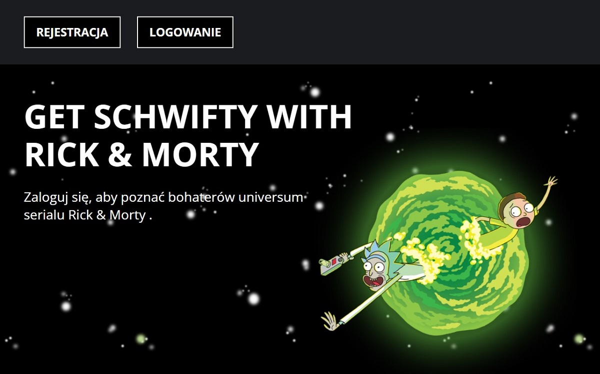

# RECRUITMENT TASK
Task based on html, css and vanilla js, no frameworks, libraries, css preprocessors have been used.

## Development state
- Application is based on four views: landing page, registartion form, login form and gated content which access is granted to after valid registration / log-in
- Each input is validated against different patterns, max/min values etc.
- Passing alias in email input is allowed
- Hash function is used on value from password input
- Each user has to be owner of unique name and email adress
- State is saved in browser local storage
- Application uses API request to get content about Rick & Morty characters (only first outcome - 20 characters)
- Additional meta data revealing after image click

## How to use it?
- Simply open index.html in browser

## Author
- Marcelina Hasiak - Design and coding
https://gist.github.com/jlevy/c246006675becc446360a798e2b2d781
- Hash function
